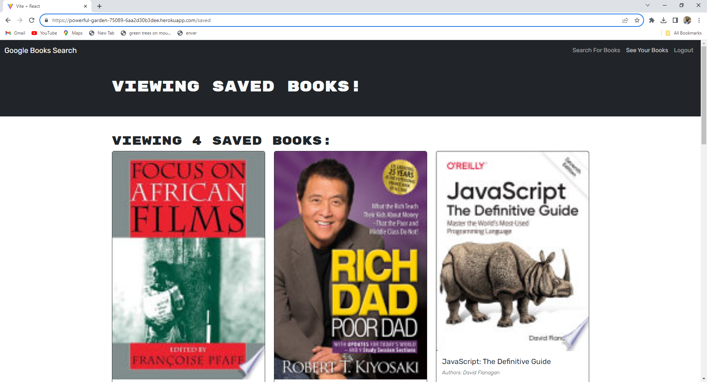

# Book Search Engine- GraphQl refactor

## Table-of-Contents

- [Description](#description)
- [Deployed Site](#deployed-site)
- [Features](#features)
- [Technologies](#technologies)
- [Future Development](#future-development)
- [Credits](#credits)

## Description

Book Search Engine is a site in which users can search for any book title or author, and search results containing their query will appear below. In this project, I integrate a GraphQL API into a fully functioning book engine that was built using the MERN stack, replacing the previous RESTful API.

## Deployed Site

Follow [this link](https://powerful-garden-75089-6aa2d30b3dee.herokuapp.com/) to view and use my site!

## Features

This is how the front-end webpage appears to viewers. It is responsive, adapting to multiple screen sizes. The main page shows new users a menu, with which they can search for books, login, or signup. If the user is logged in, the buttons they will see options to search for books, view their saved books, or logout.

Clicking the login/signup button on the main page will bring users to a login portal. The user can toggle the modal between a "sign up" or "login" option. Here they can either enter new credentials to sign up as a user in the signup section, or they can enter their already verfied credentials into the login section. To sign up, users must provide a username, a valid email address, and a password. To login, they only need to provide their email address and password for verification. Later, users can logout using the "logout" button that appears in the site's navigation.

If the user selects "search for books," they are then presented with an input field to search for books. Clicking "submit" will return a list of search results, each featuring a book's title, author, description, image, and a link to that book on the Google Books site. If the user is logged in while searching for books, then an option appears for them to save a book to their account. By clicking on the save option, that book is added to the "Saved Books" page. Users can manage their saved books from this page by deleting that book from their saved books list.

## Technologies

- React.js
- CSS
- Bootstrap
- JavaScript
- Node.js
- npm
- [Express.js](https://expressjs.com/)
- MongoDB
- [Mongoose](https://mongoosejs.com/)
- [@apollo/client](https://www.npmjs.com/package/@apollo/client)
- [apollo-server-express](https://www.npmjs.com/package/apollo-server-express)
- [graphQL](https://graphql.org/)
- [JWT](https://jwt.io/)
- [bcrypt](https://www.npmjs.com/package/bcrypt)
- [Google Books API](https://developers.google.com/books)
- [concurrently](https://www.npmjs.com/package/concurrently)
- [nodemon](https://www.npmjs.com/package/nodemon)

## Future Development

In the future, I would like to add the following improvements:

- I would like to add a note function, where users can record their thoughts about the book as they read.
- I would like to add an option where users can click on the book to view purchasing options across multiple platforms.

I'm always interested in refactoring code to improve it's functionality. If you would like to suggest your own improvements, you can reach me at the links below.

- <a href="mailto:abdulsamedtma@gmail.com">Email</a>
- <a href="https://github.com/abdulsamedtma">GitHub</a>
- <a href="https://www.linkedin.com/in/abdul-samed-alhassan-3653a02a/">LinkedIn</a>

## Credits

This project was built with the help of my tutor who did explain some of the concept to me fix some heroku deployment errors.

## Licensing

The application is covered under the following license: [MIT](https://opensource.org/licenses/MIT)